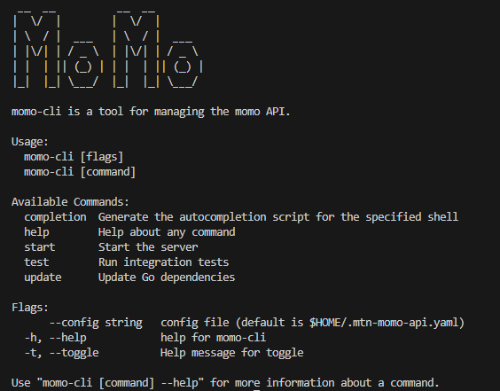

# MTN MoMo API Client for Go

<p align="center">
  
</p>

This library provides a Go client for the MTN Mobile Money API. It allows developers to interact with the MTN MoMo API for operations like getting account balance, requesting payments, and more.

## Installation

To install the library, run:

```bash
go get github.com/enzoforreal/mtn-momo-api
go get github.com/gin-gonic/gin
go get github.com/google/uuid
go get github.com/joho/godotenv
go get github.com/spf13/cobra


```

## Usage

Here's an example of how to use the library:

```Go

package main

import (
	"encoding/base64"
	"log"
	"net/http"
	"strings"

	"github.com/enzoforreal/mtn-momo-api/momo"
	"github.com/gin-gonic/gin"
	"github.com/google/uuid"
	"github.com/joho/godotenv"
)

func init() {
	err := godotenv.Load()
	if err != nil {
		log.Fatal("Error loading .env file")
	}
}

func main() {
	router := gin.Default()

	router.POST("/create-api-user", createAPIUserHandler)
	router.POST("/create-api-key", createAPIKeyHandler)
	router.POST("/get-auth-token", getAuthTokenHandler)
	router.POST("/request-to-pay", requestToPayHandler)
	router.POST("/create-oauth2-token", createOauth2TokenHandler)
	router.GET("/payment-status/:reference_id", getPaymentStatusHandler)
	router.GET("/get-account-balance", getAccountBalanceHandler)

	router.Run(":8080")
}

func createAPIUserHandler(c *gin.Context) {
	client := momo.NewClient()
	var req struct {
		ReferenceID  string `json:"reference_id"`
		CallbackHost string `json:"callback_host"`
	}
	if err := c.BindJSON(&req); err != nil {
		momo.HandleError(c, http.StatusBadRequest, err)
		return
	}

	if req.ReferenceID == "" {
		req.ReferenceID = uuid.New().String()
	}

	log.Printf("Creating API user with reference ID %s and callback host %s", req.ReferenceID, req.CallbackHost)
	if err := client.CreateAPIUser(req.ReferenceID, req.CallbackHost); err != nil {
		momo.HandleError(c, http.StatusInternalServerError, err)
		return
	}

	log.Println("API user created successfully")
	c.JSON(http.StatusCreated, gin.H{"message": "API user created successfully", "reference_id": req.ReferenceID})
}

func createAPIKeyHandler(c *gin.Context) {
	client := momo.NewClient()
	var req struct {
		ReferenceID string `json:"reference_id"`
	}
	if err := c.BindJSON(&req); err != nil {
		momo.HandleError(c, http.StatusBadRequest, err)
		return
	}

	if req.ReferenceID == "" {
		momo.HandleError(c, http.StatusBadRequest, "Reference ID is required")
		return
	}

	log.Printf("Creating API key for reference ID %s", req.ReferenceID)
	apiKey, err := client.CreateAPIKey(req.ReferenceID)
	if err != nil {
		momo.HandleError(c, http.StatusInternalServerError, err)
		return
	}

	log.Println("API key created successfully")
	c.JSON(http.StatusCreated, gin.H{"api_key": apiKey})
}

func getAuthTokenHandler(c *gin.Context) {
	authHeader := c.GetHeader("Authorization")
	if authHeader == "" {
		momo.HandleError(c, http.StatusBadRequest, "Authorization header missing")
		return
	}

	decodedAuth, err := base64.StdEncoding.DecodeString(strings.TrimPrefix(authHeader, "Basic "))
	if err != nil {
		momo.HandleError(c, http.StatusBadRequest, "Invalid authorization header")
		return
	}

	authParts := strings.SplitN(string(decodedAuth), ":", 2)
	if len(authParts) != 2 {
		momo.HandleError(c, http.StatusBadRequest, "Invalid authorization format")
		return
	}

	client := momo.NewClient()
	authToken, err := client.GetAuthToken()
	if err != nil {
		momo.HandleError(c, http.StatusInternalServerError, err)
		return
	}

	log.Println("Token retrieved successfully")
	c.JSON(http.StatusOK, gin.H{"token": authToken.AccessToken, "expires_in": authToken.ExpiresIn})
}

func getAccountBalanceHandler(c *gin.Context) {
	client := momo.NewClient()
	token := c.GetHeader("Authorization")
	if token == "" {
		momo.HandleError(c, http.StatusBadRequest, "Authorization header missing")
		return
	}

	token = strings.TrimPrefix(token, "Bearer ")
	balance, err := client.GetAccountBalance(token)
	if err != nil {
		momo.HandleError(c, http.StatusInternalServerError, err)
		return
	}

	log.Println("Account balance retrieved successfully")
	c.JSON(http.StatusOK, gin.H{"balance": balance})
}

func requestToPayHandler(c *gin.Context) {
	client := momo.NewClient()
	token := c.GetHeader("Authorization")
	if token == "" {
		momo.HandleError(c, http.StatusBadRequest, "Authorization header missing")
		return
	}
	token = strings.TrimPrefix(token, "Bearer ")

	var req momo.RequestToPay
	if err := c.BindJSON(&req); err != nil {
		momo.HandleError(c, http.StatusBadRequest, err)
		return
	}

	referenceID, err := client.RequestToPay(token, req)
	if err != nil {
		momo.HandleError(c, http.StatusInternalServerError, err)
		return
	}

	c.JSON(http.StatusAccepted, gin.H{"message": "Payment request created successfully", "reference_id": referenceID})
}

func createOauth2TokenHandler(c *gin.Context) {
	var req struct {
		AuthReqID string `form:"auth_req_id" binding:"required"`
	}
	if err := c.Bind(&req); err != nil {
		momo.HandleError(c, http.StatusBadRequest, err)
		return
	}

	client := momo.NewClient()
	oauth2Token, err := client.CreateOauth2Token(req.AuthReqID)
	if err != nil {
		momo.HandleError(c, http.StatusInternalServerError, err)
		return
	}

	log.Println("OAuth2 token retrieved successfully")
	c.JSON(http.StatusOK, oauth2Token)
}

func getPaymentStatusHandler(c *gin.Context) {
	client := momo.NewClient()
	token := c.GetHeader("Authorization")
	if token == "" {
		momo.HandleError(c, http.StatusBadRequest, "Authorization header missing")
		return
	}
	token = strings.TrimPrefix(token, "Bearer ")

	referenceID := c.Param("reference_id")
	if referenceID == "" {
		momo.HandleError(c, http.StatusBadRequest, "Reference ID is required")
		return
	}

	paymentStatus, err := client.GetPaymentStatus(referenceID, token)
	if err != nil {
		momo.HandleError(c, http.StatusInternalServerError, err)
		return
	}

	log.Printf("Payment status for reference ID %s retrieved successfully", referenceID)
	c.JSON(http.StatusOK, paymentStatus)
}


```


## Explanations

	Initialize the Client: The NewClient function creates a new client with your API key and target environment.
Get an Authentication Token: The GetAuthToken function retrieves an authentication token that is required for API calls.
Show Token: To confirm that the token has been successfully obtained.
Get Balance from Your Account: The GetAccountBalance function retrieves the balance from your account.
Show Balance: To see the available balance.
Create a Payment Request: A sample payment request is created with the necessary details.
Send Payment Request: The RequestToPay function sends the payment request and retrieves the result.
Show Payment Status: To see the status of the payment request.
This main.go file can be used as a practical example of library usage, showing how to authenticate, check the balance, and request payment. You can customize the details (such as your API key) and payment information to suit your needs.

## Testing

To run the integration tests, you can use the CLI that comes with this library. The test command allows you to execute all your integration tests with a single command.

Running the CLI

You can start the CLI application by running:

```bash

./momo-cli

```

To execute all integration tests with:

```bash

./momo-cli test


```

This command will automatically run all the integration tests defined in your codebase.


## Useful Links

Official documentation of the MTN MoMo API

[Official documentation of the MTN MoMo API](https://momodeveloper.mtn.com/)

License

This project is licensed under the MIT License.

## Project Structure


```bash

mtn-momo-api/
├── LICENSE
├── README.md
├── cmd
│   ├── root.go
│   ├── start.go
│   ├── test.go
│   └── update.go
├── example
│   └── main.go
├── go.mod
├── go.sum
├── integration.env
├── momo
│   ├── client.go
│   ├── client_test.go
│   ├── errors.go
│   └── models.go
├── test.env
└── tests
    ├── integration
    │   ├── create-api-key.sh
    │   ├── create-api-user.sh
    │   ├── get-account-balance.sh
    │   ├── get-auth-token.sh
    │   ├── payment-status.sh
    │   └── request-to-pay.sh
    └── run_integration_tests.sh

```


## Summary

Installation: Clear instructions on how to install the library.
Usage: A concrete example of using the library, complete with explanations for each step.
Endpoint Documentation: curl commands to use during your tests.
Explanations: Detailed descriptions of the functionality.
Testing: Command to run unit tests.
License: Project license type.
Project Structure: Overview of the structure of the project files and directories.
